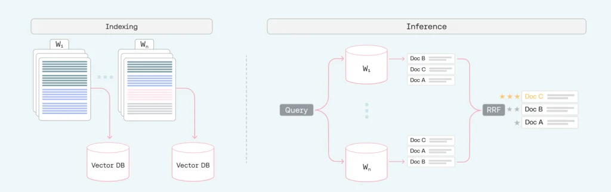
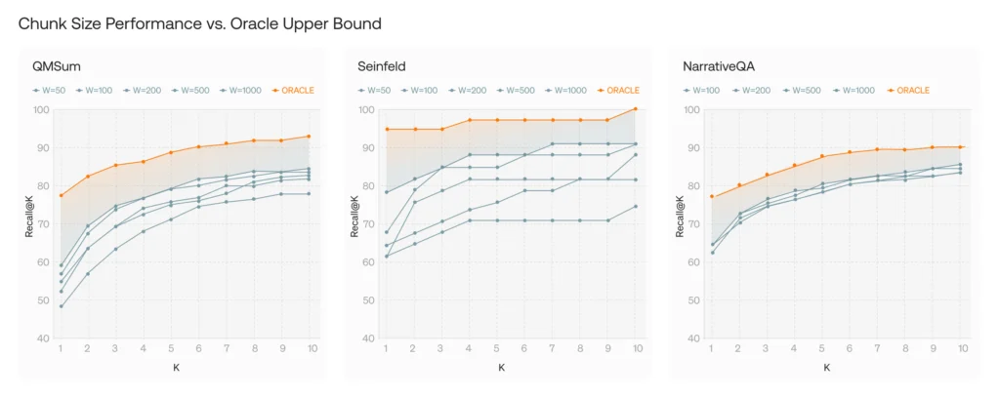

# FinanceBench RAG Evaluation Lab


A Retrieval-Augmented Generation project for financial question answering on FinanceBench. The primary assignment implementation is `rag_faiss/assignment_2_rag_faiss.ipynb`, which builds a local FAISS knowledge base from public company filings, compares naive LLM answers against RAG answers, evaluates retrieval and generation behavior, and runs improvement experiments.

The repository also includes `rag_pgvector/assignment_2_rag_pgvector.ipynb`, an optional PostgreSQL/pgvector implementation inspired by the Nebius RAG tutorial pattern: store embeddings in Managed Service for PostgreSQL with the `pgvector` extension, retrieve by vector distance, and call an OpenAI-compatible Nebius endpoint for generation. Model calls use Nebius OpenAI-compatible endpoints through `NEBIUS_API_KEY`.

<p align="center">
  
</p>

## Contents

- [What This Project Does](#what-this-project-does)
- [Results Snapshot](#results-snapshot)
- [Quickstart](#quickstart)
- [Full Project Runner](#full-project-runner)
- [Environment File](#environment-file)
- [Support And Scope](#support-and-scope)
- [Project Structure](#project-structure)
- [Notebook Workflow](#notebook-workflow)
- [Optional pgvector Workflow](#optional-pgvector-workflow)
- [Parallel API Calls](#parallel-api-calls)
- [Implementation Insights](#implementation-insights)
- [Task Summary](#task-summary)
- [References And Media](#references-and-media)
- [External Sources Reviewed](#external-sources-reviewed)

## What This Project Does

This repository answers the assignment question: how does a practical RAG pipeline behave on realistic financial QA?

The primary FAISS workflow:

1. Loads FinanceBench and filters to `domain-relevant` and `novel-generated` questions.
2. Repairs document links and normalizes evidence page metadata.
3. Builds a FAISS vector store from relevant PDFs using `BAAI/bge-small-en-v1.5`.
4. Runs naive generation with `meta-llama/Llama-3.3-70B-Instruct`.
5. Runs RAG generation with retrieved filing chunks.
6. Evaluates correctness, answer support/citation grounding, faithfulness, and evidence-page retrieval.
7. Tests improvement cycles: few-shot prompt ablation, stricter prompting, larger generation context, and reranking.
8. Tests multi-scale chunking with chunk sizes `500`, `1000`, and `2000`.

The optional pgvector workflow repeats the same assignment structure with PostgreSQL/pgvector instead of FAISS, using a Nebius-managed database and OpenAI-compatible model endpoint.

## Results Snapshot

| Area | Result |
| --- | --- |
| Filtered evaluation set | 100 FinanceBench rows |
| Indexed corpus | 42 PDFs, 5,448 pages, 24,218 chunks |
| FAISS Task 1 verdicts | 1 correct conceptual answer, 9 refused/no-answer responses |
| FAISS RAG baseline status | Saved FAISS notebook uses query-only retrieval; Task 5-7 outputs are present under `rag_faiss/outputs/` |
| Active judge model | `deepseek-ai/DeepSeek-V3.2` for correctness and Ragas faithfulness |
| FAISS Task 7 experiments | prompt ablation, strict prompting, `top_k_8`, and `bge_reranker_top4` |
| FAISS Task 7 write-up | Notebook includes per-experiment interpretations and a concrete wrap-up aligned with the saved artifacts |
| Optional pgvector workflow | Saved optional outputs are available under `rag_pgvector/outputs/` but are not the required FAISS submission path |
| Task 6 baseline metrics | 0.24 correctness, 0.396 faithfulness, 0.40 page-hit@5 |
| Multi-scale chunking oracle | FAISS: 0.53 page-hit@5; pgvector: 0.55 page-hit@5 if any tested chunk size hits |

The main finding from the saved retrieval diagnostics is that evidence-page retrieval is the largest bottleneck. Even when the retriever finds the right filing, it can miss the exact table/page needed for the FinanceBench gold answer.

The FAISS notebook source uses query-only retrieval for the baseline RAG path. Gold dataset fields such as the expected `doc_name`, `company`, and `doc_period` are used for evaluation after retrieval, not as prompt or retrieval hints. The saved FAISS evaluation flow also includes support-verifier signals: Task 6 exports `support_verdict`, `support_citation_status`, and `support_numeric_status`, and Task 7 summarizes `support_supported_rate` and `support_valid_citation_rate`.

Judge-model note: the saved FAISS notebook/results use `deepseek-ai/DeepSeek-V3.2` for the DeepSeek judge path via `NEBIUS_JUDGE_MODEL`. Judge-dependent outputs should be regenerated whenever the configured judge model changes.

<p align="center">
  
</p>

## Quickstart

Required Python version:

- Required for the FAISS notebook: Python 3.9.6.
- Tested locally: Python 3.9.6 in `.venv`.
- The first notebook cell checks the active kernel. If Python 3.9.6 is already active, it continues. If Python 3.9.6 is installed but not active, it registers a `Python 3.9.6 (assignment_2-rag)` Jupyter kernel and asks you to restart with that kernel. If Python 3.9.6 is not installed and `uv` is available, it installs Python 3.9.6 with `uv` first.

Create and activate the virtual environment from the project root:

```bash
python3.9 -m venv .venv
source .venv/bin/activate
python -m pip install --upgrade pip
```

Install the notebook runtime inside the virtual environment:

```bash
python -m pip install jupyterlab ipykernel
python -m ipykernel install --user --name financebench-rag --display-name "Python (.venv financebench-rag)"
```

Launch Jupyter Lab:

```bash
jupyter lab
```

Open `rag_faiss/assignment_2_rag_faiss.ipynb`, select the `Python (.venv financebench-rag)` kernel, and run the notebook from top to bottom.

After the Python 3.9.6 preflight cell, the notebook dependency cell installs the full dependency set with `%pip install`, including:

- `pandas`, `openpyxl`, `python-dotenv`, `tqdm`
- `urllib3<2` to avoid the macOS LibreSSL warning with Python 3.9
- `openai`
- `huggingface-hub`, `sentence-transformers`
- `langchain-community`, `langchain-huggingface`, `langchain-text-splitters`
- `faiss-cpu`, `pypdf`
- `ragas`, `eval_type_backport`

## Full Project Runner

The repository includes a Bash runner for end-to-end local execution of the FAISS assignment path:

```bash
./run_full_project.sh
```

The script creates or updates `.venv`, installs `jupyter`, `nbconvert`, and `ipykernel`, registers a local repo kernel under `.jupyter/`, validates `.env`, and executes the FAISS notebook in place by default:

1. `rag_faiss/assignment_2_rag_faiss.ipynb`

The optional pgvector notebook depends on a reachable PostgreSQL/pgvector database and is opt-in. Logs are written to `run_logs/`, which is intentionally ignored by Git. The runner also sets project-local Hugging Face cache paths with `HF_HOME` and `SENTENCE_TRANSFORMERS_HOME`, and unsets the deprecated `TRANSFORMERS_CACHE` variable before notebook execution.

The runner checks for Python 3.9.6 before creating or using `.venv`. If Python 3.9.6 is not found and `uv` is installed, it runs `uv python install 3.9.6`. If an existing `.venv` was created with a different Python version, the runner stops and asks you to remove it or set `VENV_DIR` to a new path.

Useful options:

```bash
./run_full_project.sh                  # run FAISS only
RUN_PGVECTOR=1 ./run_full_project.sh   # run FAISS, then optional pgvector
RUN_FAISS=0 RUN_PGVECTOR=1 ./run_full_project.sh  # run only pgvector
NOTEBOOK_TIMEOUT=43200 ./run_full_project.sh
TARGET_PYTHON_VERSION=3.9.6 ./run_full_project.sh
PYTHON_BIN=/path/to/python3.9 ./run_full_project.sh
ASSIGNMENT_2_API_FAITHFULNESS_WORKERS=2 ./run_full_project.sh
ASSIGNMENT_2_RAGAS_SCORE_TIMEOUT_SECONDS=90 ./run_full_project.sh
SKIP_ENV_CHECK=1 ./run_full_project.sh
```

The notebooks themselves still install their full dependency sets near the top. The script only installs the minimal notebook runner dependencies needed before `nbconvert` can start.

By default, the runner uses `NEBIUS_JUDGE_MODEL=deepseek-ai/DeepSeek-V3.2` if neither the shell nor `.env` provides a value. It also sets conservative FAISS Ragas defaults: `ASSIGNMENT_2_API_FAITHFULNESS_WORKERS=4`, `ASSIGNMENT_2_RAGAS_SCORE_TIMEOUT_SECONDS=45`, and `ASSIGNMENT_2_RAGAS_MAX_RETRIES=2` unless those variables are already set. This keeps fresh Task 6 and Task 7 runs on an available DeepSeek judge model by default and prevents a single slow faithfulness call from stalling the notebook indefinitely.

## Environment File

The notebook reads secrets from `.env` through `python-dotenv`.

Create the local file:

```bash
cp .env.template .env
```

Edit `.env`:

```text
NEBIUS_API_KEY=your_nebius_api_key_here
PGPASSWORD=your_database_password
PGHOST=your-postgres-host
PGDATABASE=your_database
PGUSER=your_database_user
# Optional: used by direct notebook runs and by run_full_project.sh when set.
NEBIUS_JUDGE_MODEL=deepseek-ai/DeepSeek-V3.2
```

Notes:

- `.env` is local and should not be committed.
- `.env.template` is the safe example file.
- Non-secret runtime settings such as endpoint URL, model IDs, SSL options, chunking, retries, and worker counts are configured in the notebooks. PostgreSQL host/user/name can be set in `.env`.
- `NEBIUS_JUDGE_MODEL` can be exported in the shell or placed in `.env` to override the runner or direct notebook path. If unset, `run_full_project.sh` defaults to `deepseek-ai/DeepSeek-V3.2`.
- If `NEBIUS_API_KEY` is missing, some notebook cells in the original FAISS notebook prompt interactively with `getpass`.
- The pgvector notebook also needs `PGPASSWORD`, `PGHOST`, `PGDATABASE`, `PGUSER`, and the Nebius PostgreSQL CA certificate at `data/nebius_msp_ca.pem`.
- The notebooks and runner configure project-local Hugging Face model cache paths under `.cache/`.

## Support And Scope

This repository is an assignment submission and reproducibility package, not a published Python library. The intended entry points are the notebooks and the generated `.xlsx` deliverables under `rag_faiss/outputs/` and `rag_pgvector/outputs/`.

For local use, start with the FAISS notebook unless you specifically need the optional pgvector comparison. The pgvector path requires a reachable PostgreSQL instance with `pgvector` enabled and local credentials in `.env`.

If something fails, check the notebook output first, then `run_logs/` when using `./run_full_project.sh`. After the project is pushed to GitHub, repository issues are the preferred place to track reproducibility problems or follow-up fixes.

## Project Structure

```text
.
|-- run_full_project.sh
|-- README.md
|-- TASK.md
|-- .env.template
|-- .gitignore
|-- rag_faiss/
|   |-- assignment_2_rag_faiss.ipynb
|   |-- artifacts/
|   `-- outputs/
|-- rag_pgvector/
|   |-- assignment_2_rag_pgvector.ipynb
|   |-- artifacts/
|   `-- outputs/
|-- data/
|   |-- financebench_filtered.jsonl
|   |-- financebench_pdfs/
|   |-- vectorstore/
|   |-- cacert.pem
|   `-- nebius_msp_ca.pem
|-- references/
|   |-- article.md
|   |-- article_media/
|   |-- paper.md
|   `-- paper_media/
`-- run_logs/
```

## Notebook Workflow

The FAISS notebook is organized so setup is at the top:

1. `%pip install` cell.
2. A single imports cell.
3. A single constants and environment setup cell.
4. Task-specific code and markdown sections.

Generated run files are written to these folders:

- Downloaded PDFs live in `data/financebench_pdfs/`.
- FAISS indices live in `data/vectorstore/`.
- Raw model answers and evaluation JSON files live in `rag_faiss/artifacts/`.
- The FAISS Task 7 reranker artifacts use the `bge_reranker_top4_*` prefix, matching the assignment suggestion to rerank FAISS top-20 down to top-4 for generation.
- Final assignment deliverables live in `rag_faiss/outputs/`.
- `rag_faiss/artifacts/` and `rag_faiss/outputs/` include `.gitkeep` placeholders so the directories stay present in fresh checkouts.

The FAISS notebook currently has `REBUILD_VECTORSTORE = False` in the constants cell, so the default behavior is to reuse the existing `data/vectorstore/financebench_bge_small_v1_5` index. Set it to `True` when you explicitly want to regenerate the baseline vector store.

The Task 7 FAISS markdown section now includes one short interpretation per experiment plus a concrete wrap-up on retrieval versus generation failure modes, and those written conclusions are kept aligned with the saved workbook/artifact metrics.

The pgvector notebook follows the same task structure but writes to:

- Raw model answers and evaluation JSON files: `rag_pgvector/artifacts/`.
- Final optional deliverables: `rag_pgvector/outputs/`.
- Vector data: PostgreSQL tables such as `financebench_chunks_bge_small_1000`, `financebench_chunks_bge_small_500`, and `financebench_chunks_bge_small_2000`.
- Current Task 5, Task 6, and most Task 7 pgvector artifacts store five retrieved chunks per answer; the `top_k_8` experiment stores eight, and the `bge_reranker_top4` experiment stores four reranked chunks.
- Task 7 summary output keeps comparable retrieval columns with FAISS: `page_hit_at_1`, `page_hit_at_3`, `page_hit_at_5`, and optional `page_hit_at_8` for the `top_k_8` experiment. The saved FAISS outputs also include support-verifier columns/rates. The pgvector BGE reranker experiment is saved as `bge_reranker_top4`, reranks top-20 candidates down to four chunks for generation, and reports `page_hit_at_4`.

## Optional pgvector Workflow

`rag_pgvector/assignment_2_rag_pgvector.ipynb` is an optional implementation path, not the required FAISS-only assignment path. It adapts the architecture from the Nebius tutorial [Building a RAG electronics store chatbot with JupyterLab, Serverless AI and Managed Service for PostgreSQL](https://docs.nebius.com/tutorials/rag#laptop-catalog-md): create a PostgreSQL database with the `pgvector` extension, store text chunks plus embedding vectors, retrieve nearest chunks by vector distance, and call an OpenAI-compatible Nebius endpoint for generation.

In this repository, that pattern is applied to FinanceBench instead of product catalog Markdown files:

- `PyPDFLoader` loads relevant public-company filings.
- `RecursiveCharacterTextSplitter` creates FinanceBench chunks.
- `BAAI/bge-small-en-v1.5` creates 384-dimensional embeddings.
- PostgreSQL stores `content`, `embedding`, `doc_name`, `company`, `doc_period`, `page_number`, chunk size, and metadata.
- Retrieval uses pgvector cosine distance with optional alternate chunk-size tables.
- Generation still uses `meta-llama/Llama-3.3-70B-Instruct`.

This notebook is useful for comparing a managed database vector store against local FAISS. It is also closer to a production deployment shape because embeddings and metadata live in a service rather than local index files. It is not a drop-in replacement for Task 3 if the grader requires the exact FAISS wording from `TASK.md`.

Operational note: the pgvector notebook requires the configured PostgreSQL host to be reachable. If that database is down or rejecting connections, run the FAISS path only with the default `./run_full_project.sh`; the saved pgvector reports in `rag_pgvector/outputs/` remain available for inspection.

## Parallel API Calls

The notebooks parallelize expensive model and retrieval loops with `ThreadPoolExecutor`. This keeps long runs practical but can increase pressure on API/database rate limits.

FAISS worker controls:

```text
ASSIGNMENT_2_API_GENERATION_WORKERS=100
ASSIGNMENT_2_API_JUDGE_WORKERS=100
ASSIGNMENT_2_API_FAITHFULNESS_WORKERS=4
ASSIGNMENT_2_RAGAS_SCORE_TIMEOUT_SECONDS=45
ASSIGNMENT_2_RAGAS_MAX_RETRIES=2
```

These are read from environment variables in the FAISS notebook. Lower the worker counts if the endpoint returns rate limits, timeouts, or transient server errors. The timeout/retry settings apply to each synchronous Ragas `.score()` call.

pgvector worker controls are defined in the notebook configuration cell:

```text
LLM_MAX_WORKERS=4
JUDGE_MAX_WORKERS=4
RETRIEVAL_MAX_WORKERS=8
RAGAS_MAX_WORKERS=2
RAGAS_MAX_TOKENS=8192
```

The pattern is intentionally conservative for Ragas faithfulness because each faithfulness score can trigger multiple judge-model calls. For reproducibility, both notebooks keep faithfulness on the first 20 sorted examples while running correctness and page-hit on the full 100-row filtered set. The FAISS support verifier is also judge-model based and runs across the full filtered set with the same judge-worker controls. The pgvector retry helper suppresses transient retry logs in notebook output; unrecovered failures still raise instead of being hidden.

## Implementation Insights

The implemented notebooks show a few practical RAG lessons:

- Evidence-page recall is much harder than document recall. The retriever often finds the correct filing but misses the exact balance-sheet or table page, which is why page-hit@5 stays around `0.39-0.40`.
- Faithfulness is not correctness. A model can faithfully answer from retrieved chunks and still be wrong if those chunks do not contain the gold evidence.
- Prompting still matters, but not always in the direction you expect. In the saved FAISS experiments, removing few-shot examples improved correctness and faithfulness, while the stricter prompt slightly hurt faithfulness with retrieval held fixed.
- Support checking is stricter than generic faithfulness. The FAISS support verifier checks whether claims, citations, numeric values, units, and periods are backed by the retrieved chunks, so it can flag polished answers that cite the wrong evidence.
- More context helps only up to a point. Sending eight chunks improved evidence coverage (`page_hit_at_8`) and correctness, but it can also introduce distracting context.
- Generic reranking is not automatically better for evidence-page retrieval. A cross-encoder can prefer semantically relevant chunks that are still not the exact gold evidence pages, so reranking should be measured with page-hit as well as correctness and faithfulness.
- Chunk size is query-dependent. The oracle score across chunk sizes reached `0.53` in FAISS and `0.55` in pgvector, higher than any single fixed size. That supports the multi-scale chunking hypothesis.

## Task Summary

| Task | What was done | Issues faced | How it was handled |
| --- | --- | --- | --- |
| Dataset preparation | Loaded FinanceBench, dropped `metrics-generated`, normalized evidence objects, and wrote `data/financebench_filtered.jsonl`. | Some original document URLs were not reliable, and evidence fields needed list normalization. | Built repo/raw link columns for later PDF loading and extracted evidence page numbers into a consistent list column. |
| Task 1 - naive generation | Sent the first five `domain-relevant` and first five `novel-generated` questions directly to `Llama-3.3-70B-Instruct`, then manually judged answers. | The FAISS naive run mostly refused because the standalone questions did not include filing data; one conceptual JPMorgan gross-margin answer was correct. | Saved raw answers in `rag_faiss/artifacts/`, assigned verdicts, and exported the naive-generation workbook. |
| Task 2 - RAG reminder | Explained indexing, retrieval, and generation responsibilities and failure modes. | The hard part was separating retrieval failures from generation failures. | Wrote the pipeline as three explicit stages so later metrics could diagnose each component. |
| Task 3 - embed documents | Downloaded relevant PDFs, loaded pages with `PyPDFLoader`, attached metadata, split pages with `chunk_size=1000`, embedded with BGE small, and saved FAISS. | PDF extraction can mangle tables; semantic retrieval confused similar filings and periods. | Saved reusable FAISS indices and audited top-5 retrieval against `doc_name`, evidence text, and page metadata. |
| Task 4 - RAG pipeline | Built `answer_with_rag(query, k=...)` to retrieve chunks, format context, call the model, and return answer plus chunk metadata. | Retrieved context can be empty, partial, or from the wrong filing. | The FAISS baseline retrieves with the user query only, includes retrieved chunk `doc_name` and `page_number` for citations, and handles empty context explicitly. |
| Task 5 - run and compare | Runs the same 10 Task 1 questions through RAG and exports side-by-side naive vs RAG answers. | RAG can help refusals when retrieval finds evidence, but it can also hurt when retrieval misses balance-sheet pages or conceptual context. | The saved workbook reflects query-only retrieval. |
| Task 6 - evaluation | Runs all 100 filtered examples through RAG and evaluates correctness, support/citation grounding, Ragas faithfulness, and page-hit@1/3/5. | Faithfulness is slow because it makes multiple judge calls and can exceed judge output limits; support checking adds another full-set judge pass. | Limits faithfulness to the first 20 examples, shortens retrieved contexts for Ragas/support checks, bounds each FAISS Ragas score with a timeout, and standardizes judging on `deepseek-ai/DeepSeek-V3.2`. |
| Task 7 - improvement cycles | Tests few-shot prompt ablation, strict prompting, `k=8`, and BGE reranking against the Task 6 baseline. | Reranking may reduce page-hit if it prefers semantically similar chunks over exact evidence pages. | Keeps one change per experiment where possible; FAISS reranks top-20 to top-4 and reports comparable page-hit columns plus optional `page_hit_at_8`. |
| Bonus - multi-scale chunking | Built or reused chunk-size indices for `500`, `1000`, and `2000`, then compared page-hit@5. | No single chunk size dominated; page-level evidence retrieval is stricter than document-level recall. | Reported fixed-size scores and oracle scores showing 0.53 FAISS page-hit@5 and 0.55 pgvector page-hit@5 if any tested size hits. |

## References And Media

### FinanceBench Paper

Local reference: `references/paper.md`

Concise summary:

FinanceBench is a benchmark for open-book financial QA over public company filings. Its core warning is practical: retrieval and reasoning failures both matter, and an answer that looks polished can still be unsupported, numerically wrong, or based on the wrong filing. This project mirrors that lesson by evaluating final correctness, answer support, and retrieval page-hit separately.

Key insight used here:

- Shared vector stores are difficult because the retriever must find the correct company, filing period, page, and financial table before the LLM can reason.
- Refusals are not always bad; a grounded refusal can be safer than a confident hallucination.
- Long-context or oracle-like settings perform better in the paper, but they are less realistic for scalable enterprise workflows.

Media:

<p align="center">
  
</p>

### Query-Dependent Chunking Article

Local reference: `references/article.md`

Concise summary:

The article argues that chunk size is query-dependent. Small chunks preserve precise details, while large chunks preserve broader context. Instead of choosing a single fixed size, the article proposes indexing the same corpus at multiple chunk sizes and aggregating retrieval results with Reciprocal Rank Fusion.

Key insight used here:

- The bonus experiment tested this idea on FinanceBench with chunk sizes `500`, `1000`, and `2000`.
- The best fixed size was `1000` in both runs: `0.40` page-hit@5 in FAISS and `0.40` in pgvector. The oracle across all three sizes reached `0.53` in FAISS and `0.55` in pgvector.
- That gap supports the article's claim that different queries benefit from different chunk sizes.

Media:

<p align="center">
  
</p>

## External Sources Reviewed

The README structure follows common current AI repo conventions: compact value proposition, badges, quickstart, project structure, reproducibility notes, results table, architecture/media, and references. I checked popular AI repositories and official docs for those conventions and for technical context:

- [FinanceBench dataset card on Hugging Face](https://huggingface.co/datasets/PatronusAI/financebench) - dataset scope, files, evidence fields, and benchmark framing.
- [AI21 query-dependent chunking article](https://www.ai21.com/blog/query-dependent-chunking/) - multi-scale indexing and RRF motivation.
- [Ragas Faithfulness docs](https://docs.ragas.io/en/v0.3.3/concepts/metrics/available_metrics/faithfulness/) - faithfulness as consistency between answer claims and retrieved context.
- [LangChain GitHub README](https://github.com/langchain-ai/langchain) - concise AI framework README pattern with badges, quickstart, and ecosystem links.
- [LlamaIndex GitHub README](https://github.com/run-llama/llama_index) - data/RAG framework README pattern with overview, install path, and example usage.
- [Ragas GitHub README](https://github.com/explodinggradients/ragas) - evaluation-focused README pattern with features, install, and quickstart.
- [Nebius RAG tutorial](https://docs.nebius.com/tutorials/rag#laptop-catalog-md) - reference architecture for using JupyterLab, Managed Service for PostgreSQL with `pgvector`, and an OpenAI-compatible Serverless AI endpoint for RAG.
